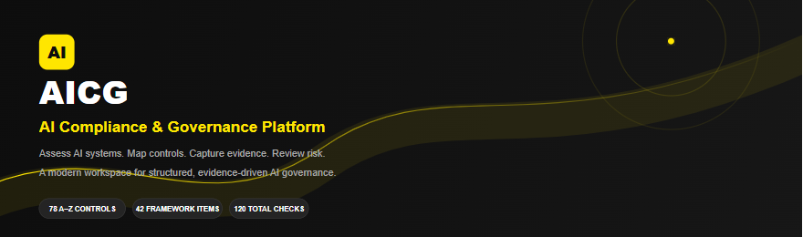
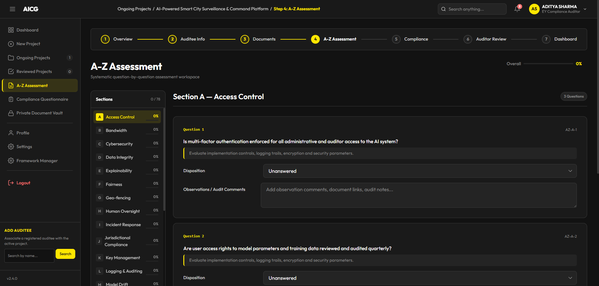
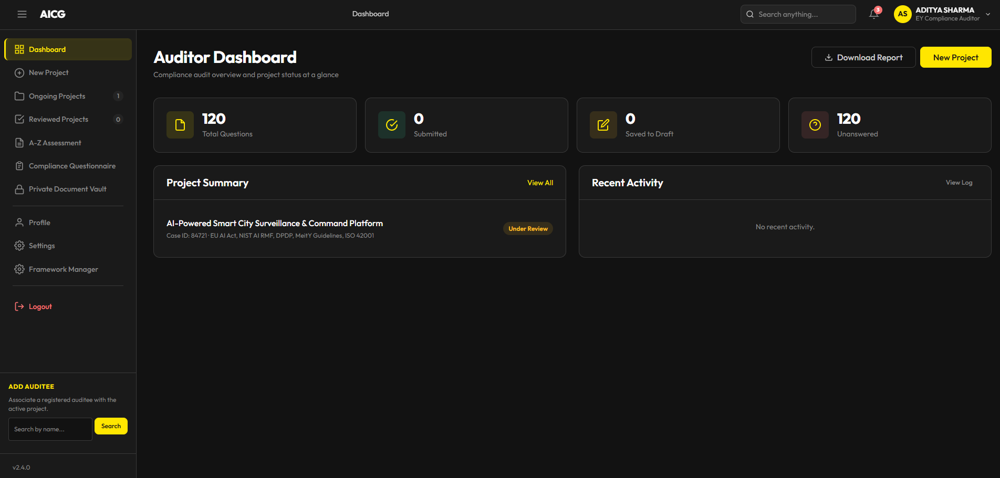

<div align="center">

<h1>🛡️ AI Compliance & Governance Platform</h1>

<p>
  <strong>AI Governance · Compliance Assessment · LLM Analysis · Risk Management</strong>
</p>

<br>

<p>
  
  
  
  
</p>

<br>

<p>
  <em>
    A full-stack platform for analyzing AI governance frameworks,
    <br>
    conducting structured compliance assessments,
    and managing evidence through an auditable workflow.
  </em>
</p>

<br>



<br>

<sub>
  Auditor dashboard — centralized view of AI compliance assessment activity
</sub>

</div>

---

## AI Governance, Built as an Engineering System

AI systems are not evaluated by model performance alone.

They also need to be assessed for **security, privacy, fairness, explainability,
human oversight, risk, transparency, and regulatory alignment**.

**AICG** brings these dimensions into a structured assessment workflow —
combining **LLM-powered framework analysis**, a predefined **A–Z governance
assessment engine**, evidence management, and auditor review.

---

---

## 🚀 Project Overview

AI systems are increasingly being deployed in environments where **model
performance alone is not enough**.

Organizations also need to understand:

- 🔐 How securely the system operates
- 🛡️ How sensitive data is handled
- ⚖️ Whether the system introduces unfair or discriminatory outcomes
- 🔍 Whether AI decisions can be explained
- 👤 Where human oversight is required
- ⚠️ How AI-related risks are identified and managed
- 📋 Whether governance and regulatory requirements are being addressed

However, these assessments are often distributed across **framework
documents, spreadsheets, evidence files, questionnaires, and manual reviews**.

### AICG brings these activities into a single workflow.

The platform combines:

**LLM-powered framework analysis → structured assessment → evidence collection → compliance review**

to provide a more consistent and traceable approach to AI governance.

---

## 🎯 Objectives

The project was designed around four primary objectives:

| Objective | Description |
|---|---|
| 🤖 **Framework Intelligence** | Use Gemini to analyze uploaded governance and regulatory documents and transform unstructured content into structured assessment material. |
| 🔤 **A–Z Assessment** | Provide a standardized 26-domain assessment model containing 78 structured governance questions. |
| 📎 **Evidence-Driven Assessment** | Allow assessment decisions to be supported by documents, observations, and audit evidence. |
| 📊 **Centralized Governance** | Provide a single workspace for project creation, framework selection, assessment, review, and reporting. |

---

---

## 📚 Governance Inputs & Frameworks

AICG is designed to work with multiple sources of governance requirements
rather than relying on a single compliance standard.

The platform supports both **predefined framework assessments** and
**LLM-assisted analysis of uploaded framework documents**.

### Supported Governance Frameworks

| Framework | Primary Focus |
|---|---|
| 🇪🇺 **EU AI Act** | AI regulation, risk classification, transparency, and governance |
| 🛡️ **NIST AI RMF** | AI risk identification, measurement, management, and governance |
| 📘 **ISO/IEC 42001** | AI management systems and organizational governance |
| 🔐 **DPDP Act** | Digital personal data protection and privacy obligations |
| 🇮🇳 **MeitY Guidelines** | AI governance and responsible AI guidance |

---

### 🧩 Two Sources of Assessment Intelligence

AICG combines two complementary approaches:

#### 01 — Predefined Governance Model

The platform contains a structured **A–Z assessment model** covering
26 governance domains and 78 assessment questions.

This provides a consistent baseline for evaluating an AI system.

### 🔤 A–Z AI Governance Assessment

AICG organizes its core assessment model into **26 governance domains**, with
structured questions designed to evaluate different dimensions of an AI system.

| Letter | Governance Domain | Assessment Focus |
|:------:|---|---|
| **A** | **Access Control** | Authentication, authorization, and controlled access to AI resources |
| **B** | **Bandwidth** | Resource capacity, system load, and availability considerations |
| **C** | **Cybersecurity** | Protection of AI systems, infrastructure, and associated assets |
| **D** | **Data Integrity** | Accuracy, consistency, reliability, and integrity of data |
| **E** | **Explainability** | Ability to explain AI outputs, decisions, and system behavior |
| **F** | **Fairness** | Identification and mitigation of bias and discriminatory outcomes |
| **G** | **Geo-fencing** | Geographic restrictions and location-based governance controls |
| **H** | **Human Oversight** | Human supervision, intervention, and decision-making authority |
| **I** | **Incident Response** | Detection, handling, escalation, and recovery from AI-related incidents |
| **J** | **Jurisdictional Compliance** | Compliance with applicable geographic and regulatory requirements |
| **K** | **Key Management** | Protection and lifecycle management of cryptographic keys and secrets |
| **L** | **Logging & Auditing** | Event logging, traceability, monitoring, and auditability |
| **M** | **Model Drift** | Detection and management of changes in model behavior or performance |
| **N** | **Network Security** | Protection of network infrastructure and AI communication channels |
| **O** | **Operational Resilience** | Availability, recovery, continuity, and resilience of AI operations |
| **P** | **Privacy** | Protection of personal and sensitive information throughout the AI lifecycle |
| **Q** | **Quality Assurance** | Testing, validation, reliability, and quality control |
| **R** | **Risk Management** | Identification, assessment, mitigation, and monitoring of AI risks |
| **S** | **Security** | Security controls protecting AI models, data, applications, and infrastructure |
| **T** | **Transparency** | Disclosure of AI usage, system characteristics, limitations, and governance |
| **U** | **User Rights** | Protection and enforcement of rights available to users and affected individuals |
| **V** | **Validation** | Verification and validation of AI models, outputs, and system behavior |
| **W** | **Workforce Governance** | Roles, responsibilities, training, and accountability of personnel |
| **X** | **Explainable AI (XAI)** | Techniques for interpreting and communicating model behavior |
| **Y** | **Yield / Performance** | Evaluation of system performance, efficiency, and operational outcomes |
| **Z** | **Zero Trust** | Least-privilege access, continuous verification, and trust minimization |

<br>

> **26 governance domains → 78 structured assessment questions**

#### 02 — LLM-Assisted Framework Analysis

AICG extends its predefined assessment model with an **LLM-assisted
framework analysis workflow**.

Governance and regulatory documents can be provided as inputs to the
Gemini-powered analysis layer. The system processes the document and
extracts structured information that can be used to build assessment
content.

```text
┌──────────────────────────────┐
│  Governance / Regulatory     │
│          Document            │
└──────────────┬───────────────┘
               │
               ▼
┌──────────────────────────────┐
│      Document Ingestion      │
└──────────────┬───────────────┘
               │
               ▼
┌──────────────────────────────┐
│       Gemini Analysis        │
│                              │
│  • Framework Content         │
│  • Requirements              │
│  • Sections                  │
│  • Assessment Questions      │
└──────────────┬───────────────┘
               │
               ▼
┌──────────────────────────────┐
│   Structured Governance      │
│        Information           │
└──────────────┬───────────────┘
               │
               ▼
┌──────────────────────────────┐
│      AICG Assessment         │
└──────────────────────────────┘

```

### 🔗 From Framework to Assessment

The overall flow can be represented as:

```text
                         GOVERNANCE INPUT
                                │
                  ┌─────────────┴─────────────┐
                  │                           │
                  ▼                           ▼
        ┌─────────────────┐         ┌─────────────────┐
        │    Predefined   │         │    Uploaded     │
        │    Framework    │         │    Document     │
        └────────┬────────┘         └────────┬────────┘
                 │                           │
                 │                           ▼
                 │                  ┌─────────────────┐
                 │                  │ Gemini Analysis │
                 │                  └────────┬────────┘
                 │                           │
                 └─────────────┬─────────────┘
                               ▼
                  ┌─────────────────────────┐
                  │ Structured Requirements │
                  └────────────┬────────────┘
                               │
                               ▼
                  ┌─────────────────────────┐
                  │   Assessment Questions  │
                  └────────────┬────────────┘
                               │
                               ▼
                  ┌─────────────────────────┐
                  │     AI System Review    │
                  └────────────┬────────────┘
                               │
                     ┌─────────┴─────────┐
                     │                   │
                     ▼                   ▼
             ┌───────────────┐   ┌───────────────┐
             │    Evidence   │   │    Findings   │
             └───────┬───────┘   └───────┬───────┘
                     │                   │
                     └─────────┬─────────┘
                               ▼
                  ┌─────────────────────────┐
                  │    Compliance Review    │
                  └─────────────────────────┘
```

---

## 🔤 Assessment Engine

At the core of AICG is a structured **A–Z AI Governance Assessment Engine**.

The assessment model organizes AI governance into **26 domains**, with
**3 structured questions per domain**, resulting in **78 assessment questions**.

This provides a consistent baseline for evaluating an AI system across
technical, operational, security, privacy, and governance dimensions.

### Assessment Model

```text
                    A–Z ASSESSMENT ENGINE
                            │
                            ▼
                 ┌──────────────────────┐
                 │    26 DOMAINS        │
                 └──────────┬───────────┘
                            │
                  3 Questions / Domain
                            │
                            ▼
                 ┌──────────────────────┐
                 │   78 QUESTIONS      │
                 └──────────┬───────────┘
                            │
                            ▼
                 ┌──────────────────────┐
                 │   AI SYSTEM REVIEW   │
                 └──────────┬───────────┘
                            │
              ┌─────────────┼─────────────┐
              ▼             ▼             ▼
          Response       Evidence      Observation
              │             │             │
              └─────────────┼─────────────┘
                            ▼
                 ┌──────────────────────┐
                 │  AUDITOR / COMPLIANCE│
                 │       REVIEW         │
                 └──────────────────────┘
```

---

## 🤖 LLM-Assisted Analysis Pipeline

AICG integrates **Google Gemini** into the governance workflow to process
regulatory and framework documents and convert unstructured information
into structured assessment content.

The LLM layer is designed as an **assistive intelligence component**:
it accelerates document analysis and question generation while keeping
the final assessment workflow under human review.

### 🧠 Processing Pipeline

```text
                 GOVERNANCE DOCUMENT
                         │
                         ▼
              ┌─────────────────────┐
              │  Document Ingestion │
              └──────────┬──────────┘
                         │
                         ▼
              ┌─────────────────────┐
              │   Gemini / LLM      │
              │      Analysis       │
              └──────────┬──────────┘
                         │
              ┌──────────┼──────────┐
              ▼          ▼          ▼
        Framework    Requirements  Sections
         Content
              │          │          │
              └──────────┼──────────┘
                         ▼
              ┌─────────────────────┐
              │ Structured Content  │
              └──────────┬──────────┘
                         │
                         ▼
              ┌─────────────────────┐
              │ Assessment Questions│
              └──────────┬──────────┘
                         │
                         ▼
              ┌─────────────────────┐
              │   Human Assessment  │
              │       & Review      │
              └─────────────────────┘
```

---

## 🗄️ Data Architecture

AICG uses **Supabase / PostgreSQL** as the persistence layer for
authentication, project data, uploaded documents, and assessment responses.

The data model is centered around the **project** as the primary unit of
an assessment.

### Core Data Model

```text
                         ┌─────────────────┐
                         │      USERS      │
                         │                 │
                         │ Identity        │
                         │ Role            │
                         │ Organization    │
                         │ Profile         │
                         └────────┬────────┘
                                  │
                                  │ owns / participates in
                                  ▼
                         ┌─────────────────┐
                         │    PROJECTS     │
                         │                 │
                         │ Case / Scope    │
                         │ Frameworks      │
                         │ Project Status  │
                         │ Assessment Data │
                         └───────┬─────────┘
                                 │
                    ┌────────────┴────────────┐
                    │                         │
                    ▼                         ▼
          ┌─────────────────┐       ┌─────────────────┐
          │    DOCUMENTS    │       │    RESPONSES    │
          │                 │       │                 │
          │ Evidence        │       │ Assessment      │
          │ Files           │       │ Answers         │
          │ References      │       │ Observations    │
          └─────────────────┘       └─────────────────┘
```
---

## 🏗️ System Architecture

AICG follows a modular full-stack architecture in which the web interface,
application layer, persistence layer, and AI services work together to
support the assessment lifecycle.

### High-Level Architecture

```text
                              ┌───────────────────────┐
                              │         USER          │
                              │  Auditor / Auditee    │
                              └───────────┬───────────┘
                                          │
                                          ▼
                         ┌─────────────────────────────┐
                         │        AICG FRONTEND        │
                         │                             │
                         │  Dashboard                  │
                         │  Project Management         │
                         │  A–Z Assessment             │
                         │  Documents / Evidence      │
                         │  Compliance Review          │
                         └──────────────┬──────────────┘
                                        │
                                        ▼
                         ┌─────────────────────────────┐
                         │      APPLICATION LAYER      │
                         │                             │
                         │  Node.js                    │
                         │  API / Server Logic         │
                         │  Assessment Processing      │
                         │  Report Generation          │
                         └───────┬───────────┬─────────┘
                                 │           │
                    ┌────────────┘           └─────────────┐
                    │                                      │
                    ▼                                      ▼
          ┌─────────────────────┐              ┌─────────────────────┐
          │      SUPABASE       │              │       GEMINI        │
          │                     │              │                     │
          │  Authentication     │              │  Framework Analysis │
          │  PostgreSQL         │              │  Question Generation│
          │  Documents         │              │  AI-Assisted Output │
          │  Assessment Data    │              │  Report Intelligence│
          └─────────────────────┘              └──────────┬──────────┘
                                                          │
                                                          ▼
                                             ┌─────────────────────┐
                                             │   STRUCTURED AI     │
                                             │     GOVERNANCE      │
                                             │                     │
                                             │  Requirements       │
                                             │  Questions          │
                                             │  Assessment Content │
                                             └──────────┬──────────┘
                                                        │
                                                        ▼
                                             ┌─────────────────────┐
                                             │   A–Z ASSESSMENT    │
                                             │       ENGINE        │
                                             │                     │
                                             │  26 Domains         │
                                             │  78 Questions       │
                                             │  Responses          │
                                             │  Evidence           │
                                             └──────────┬──────────┘
                                                        │
                                                        ▼
                                             ┌─────────────────────┐
                                             │   REVIEW / REPORT   │
                                             │                     │
                                             │  Findings            │
                                             │  Compliance Review  │
                                             │  PDF Output         │
                                             └─────────────────────┘
```
---

## 🖥️ Product Walkthrough

AICG provides a unified interface for moving from **project creation** to
**AI governance assessment and review**.

The following screens illustrate the primary workflow of the platform.

---

### 01 · Authentication

The platform begins with an authenticated workspace, providing controlled
access to the compliance assessment environment.

<p align="center">
  
</p>

<p align="center">
  <em>Secure entry point to the AICG compliance workspace.</em>
</p>

---

### 02 · Project Creation

Each assessment begins with a project that defines the AI system,
assessment context, applicable frameworks, and supporting documentation.

<p align="center">
  
</p>

<p align="center">
  <em>Creating an AI governance assessment project and defining its scope.</em>
</p>

---

### 03 · A–Z Governance Assessment

The assessment workspace provides a structured control-by-control interface
for evaluating the AI system across the A–Z governance domains.

<p align="center">
  
</p>

<p align="center">
  <em>Structured A–Z assessment interface for governance and compliance review.</em>
</p>

---

### 04 · Auditor Dashboard

The dashboard provides a consolidated view of assessment activity, including
question progress, submitted responses, drafts, unanswered controls, and
active projects.

<p align="center">
  
</p>

<p align="center">
  <em>Centralized assessment dashboard for monitoring project progress and review activity.</em>
</p>

---

### 🔄 End-to-End User Journey

```text
      AUTHENTICATE
           │
           ▼
    CREATE PROJECT
           │
           ▼
   SELECT FRAMEWORKS
           │
           ▼
   UPLOAD / COLLECT
       EVIDENCE
           │
           ▼
    RUN ASSESSMENT
           │
           ▼
     RECORD FINDINGS
           │
           ▼
      REVIEW RESULTS
           │
           ▼
        REPORT
```
---

## 🛠️ Tech Stack

AICG combines a lightweight web application layer with managed data
infrastructure and an LLM service to support the complete assessment
workflow.

### Core Stack

| Layer | Technology | Role |
|---|---|---|
| **Frontend** | HTML5 · CSS3 · JavaScript | Application interface, dashboards, project workflows, and assessments |
| **Application** | Node.js | Server-side application logic and API handling |
| **Database** | Supabase / PostgreSQL | Persistent application and assessment data |
| **Authentication** | Supabase Auth | User authentication and session management |
| **AI / LLM** | Google Gemini | Framework analysis, question generation, and AI-assisted workflows |
| **Reporting** | PDF Generation | Assessment and compliance report generation |
| **Deployment** | Vercel | Application hosting and deployment |

---

## 🧠 Engineering Choices

### Why Gemini?

The platform needs to work with governance material that may not initially
exist in a structured question-and-answer format.

Gemini provides the LLM layer required to analyze framework documents and
transform relevant content into structured governance information.

```text
Unstructured Document
        │
        ▼
      Gemini
        │
        ▼
Structured Governance Content
        │
        ▼
Assessment Workflow
```

---

## 🔄 Engineering Workflow

AICG follows an evidence-driven assessment workflow that connects
governance inputs, LLM-assisted analysis, structured assessment,
supporting evidence, and human review.

### End-to-End Pipeline

```text
┌──────────────────────────────┐
│  01 · GOVERNANCE INPUTS      │
│                              │
│  Frameworks                  │
│  Regulatory Documents        │
│  Project Information         │
└──────────────┬───────────────┘
               │
               ▼
┌──────────────────────────────┐
│  02 · DOCUMENT ANALYSIS      │
│                              │
│  Gemini / LLM                │
│  Content Extraction          │
│  Requirement Identification  │
└──────────────┬───────────────┘
               │
               ▼
┌──────────────────────────────┐
│  03 · STRUCTURED CONTENT     │
│                              │
│  Requirements                │
│  Sections                    │
│  Assessment Questions        │
└──────────────┬───────────────┘
               │
               ▼
┌──────────────────────────────┐
│  04 · ASSESSMENT ENGINE      │
│                              │
│  A–Z Governance Model        │
│  26 Domains                  │
│  78 Questions                │
└──────────────┬───────────────┘
               │
               ▼
┌──────────────────────────────┐
│  05 · EVIDENCE COLLECTION    │
│                              │
│  Documents                   │
│  References                  │
│  Observations                │
└──────────────┬───────────────┘
               │
               ▼
┌──────────────────────────────┐
│  06 · HUMAN REVIEW           │
│                              │
│  Assessment Responses        │
│  Findings                    │
│  Compliance Review           │
└──────────────┬───────────────┘
               │
               ▼
┌──────────────────────────────┐
│  07 · REPORTING              │
│                              │
│  Assessment Results          │
│  Audit Information           │
│  PDF Output                  │
└──────────────────────────────┘
```
---

## 📝 Assessment Response Model

Each AICG assessment question is treated as an individual governance
assessment item.

Rather than capturing only a binary answer, the workflow records the
assessment outcome together with supporting context.

### Control-Level Assessment

```text
                    GOVERNANCE CONTROL
                           │
                           ▼
                ┌─────────────────────┐
                │ Assessment Question │
                └──────────┬──────────┘
                           │
                           ▼
                ┌─────────────────────┐
                │ Auditor Evaluation  │
                └──────────┬──────────┘
                           │
              ┌────────────┼────────────┐
              ▼            ▼            ▼
        ┌───────────┐ ┌───────────┐ ┌───────────┐
        │Disposition│ │Observation│ │  Evidence │
        └─────┬─────┘ └─────┬─────┘ └─────┬─────┘
              │             │             │
              └─────────────┼─────────────┘
                            ▼
                 ┌─────────────────────┐
                 │ Assessment Response │
                 └──────────┬──────────┘
                            │
                            ▼
                 ┌─────────────────────┐
                 │ Review / Reporting  │
                 └─────────────────────┘
```
---

## 📄 Reporting & Output

Assessment information collected throughout the AICG workflow can be
converted into structured reporting output for downstream review.

The reporting layer brings together project context, assessment responses,
observations, and supporting information into a consolidated document.

### Reporting Flow

```text
┌──────────────────────────┐
│     PROJECT CONTEXT      │
│                          │
│  Project Information     │
│  Frameworks              │
│  Assessment Scope        │
└────────────┬─────────────┘
             │
             ▼
┌──────────────────────────┐
│   ASSESSMENT RESPONSES   │
│                          │
│  Questions               │
│  Dispositions            │
│  Observations            │
└────────────┬─────────────┘
             │
             ▼
┌──────────────────────────┐
│     EVIDENCE / DATA      │
│                          │
│  Documents               │
│  Supporting Information  │
└────────────┬─────────────┘
             │
             ▼
      ┌───────────────┐
      │   REPORTING   │
      │     LAYER     │
      └───────┬───────┘
              │
              ▼
┌──────────────────────────┐
│      PDF / REPORT        │
│                          │
│  Assessment Summary      │
│  Findings                │
│  Review Information      │
└──────────────────────────┘
```
---

## 🧠 Engineering Decisions

AICG was designed around a few deliberate architectural decisions rather
than simply combining technologies.

The goal was to keep the platform **practical, extensible, and
human-reviewable** while introducing LLM capabilities where they provide
the most value.

---

### 01 · Why Gemini?

Governance and regulatory documents are often **long, unstructured, and
difficult to translate directly into application logic**.

Instead of manually converting every framework into application-specific
questions, AICG introduces Gemini as an interpretation layer.

```text
Governance Document
        │
        ▼
      Gemini
        │
        ▼
Structured Requirements
        │
        ▼
Assessment Questions
```
---

## 🔐 Security & Responsible AI

AICG operates at the intersection of **AI, governance, and potentially
sensitive organizational information**. The architecture therefore
separates authentication, application logic, persistent data, and
LLM-assisted processing.

### 🔒 Application Security

The current architecture uses Supabase Authentication as the identity
layer and keeps application data within the platform's persistence layer.

```text
                    USER
                     │
                     ▼
              ┌─────────────┐
              │ SUPABASE    │
              │    AUTH     │
              └──────┬──────┘
                     │
                     ▼
              Authenticated
                 Session
                     │
                     ▼
              ┌─────────────┐
              │ AICG APP    │
              └──────┬──────┘
                     │
              ┌──────┴──────┐
              ▼             ▼
          Application      Data
             Logic       Persistence
```
AICG is a working full-stack prototype deployed on Vercel. The current
implementation establishes the core assessment, framework-analysis,
evidence, and review workflows, while several areas remain open for
further engineering.

### Current Limitations

| Area | Current State |
|---|---|
| **Risk Scoring** | The platform does not currently calculate a formal automated compliance or risk score. |
| **Framework Mapping** | Framework-specific assessment content exists, but a complete automated cross-framework control mapping is not yet implemented. |
| **LLM Validation** | LLM-generated content still requires human verification and review. |
| **Access Control** | Additional enterprise-grade RBAC and organizational isolation would be required for broader production deployment. |
| **Continuous Monitoring** | The current workflow focuses on assessment rather than continuous AI-system monitoring. |
